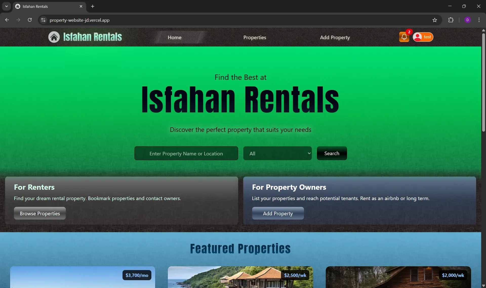

# 🏡 Isfahan Rentals

A full-featured, mobile-friendly real estate listing web application built with **Next.js 15**, **TypeScript**, and **Tailwind CSS**. This project is an improved and extended version of Brad Traversy's Property Pulse course javascript project, enhanced with modern UI/UX upgrades, advanced features, and production-ready optimizations.

**🔗 Live Demo:** [property-website-jd.vercel.app](https://property-website-jd.vercel.app/)

---

## 🧪 Test User

You can log in as a test user to explore the platform:

**Email:** test@test.com
**Password:** test

---

## 🖼 Preview

---

## 🚀 Tech Stack

- **Framework**: Next.js 15 (App Router)
- **Language**: TypeScript
- **Styling**: Tailwind CSS v4
- **Authentication**: NextAuth.js (Credentials Provider + JWT)
- **Database**: MongoDB (via Mongoose)
- **Image Hosting**: Cloudinary (client-side uploads)
- **Maps**: Leaflet
- **Deployment**: Vercel

---

## 🌟 Features & Improvements

### 🌐 General Enhancements
- Fully responsive design optimized for all screen sizes.
- Custom font implemented via `next/font` to prevent FOUT (Flash of Unstyled Text).
- Featured Properties section is now horizontally centered and scrollable on the homepage.
- Properties page auto-scrolls to relevant sections based on screen size.
- Optional scroll restoration added to retain scroll position when navigating back.

### 📦 Properties Functionality
- **Geo-location support**: Properties can now be pinned on an interactive map; location data is saved with each listing.
- **Edit page enhancements**:
  - Restores all property data including pinned map location.
  - Allows re-positioning of the map pin.
  - Restores previously uploaded images with options to delete or add new ones.
- **Pagination**:
  - Server-side pagination implemented on both the Properties and Search Results pages.
  - Search Results page now displays the total number of results.

### 🖼️ Image Upload Experience
- Switched from server-side to client-side image uploads to avoid timeout errors and enhance UX.
- Real-time upload progress indicator added.
- Successfully uploaded images are displayed as small previews with file names.
- Users can delete uploaded images before submitting the form.
- Deleted images are also removed from Cloudinary to prevent orphaned files and reduce clutter.

### 🔐 Authentication & Authorization
- Integrated authentication using **NextAuth Credentials Provider** with JWT strategy.
- Sign-in and sign-out include full page refreshes and proper redirects to prevent UI inconsistencies and fix redirect issues.
- Middleware added to protect routes and store callback URLs for redirecting users after successful login.

### 👤 Profile & Account Management
- Profile page displays user property listings in a clean, scrollable UI—showing one property per view with pixel-accurate responsiveness.
- **Delete Account** functionality added: completely removes the user and all associated listings from the database.

### 💬 Messaging System
- Messages page displays:
  - Total number of messages.
  - Message index for each entry.
  - Responsive, scrollable UI with one message visible per scroll view.
- Supports client-side message deletion and automatic UI update.

---
